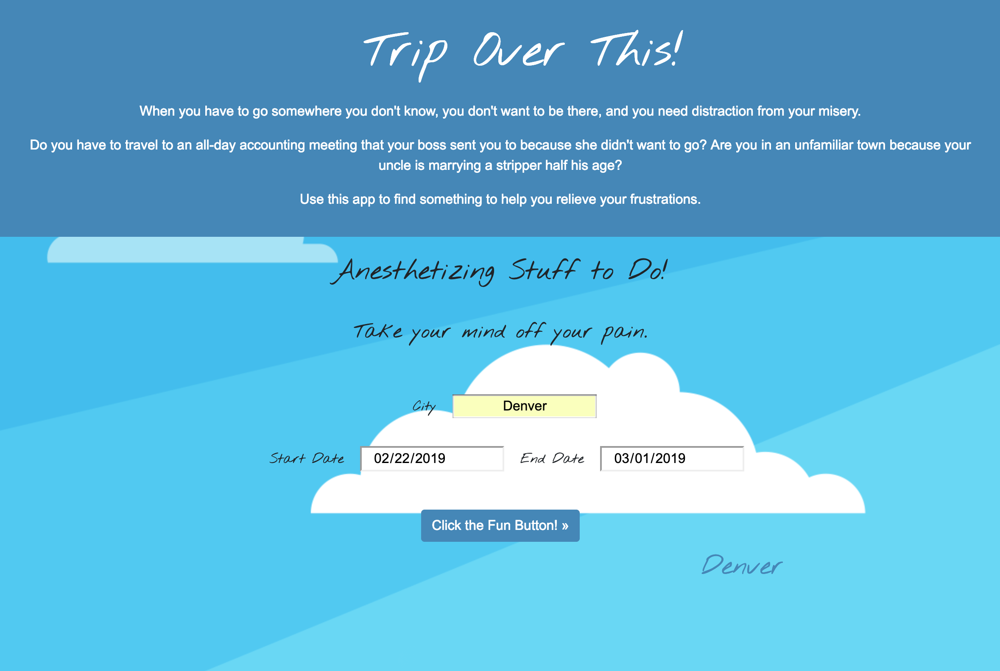
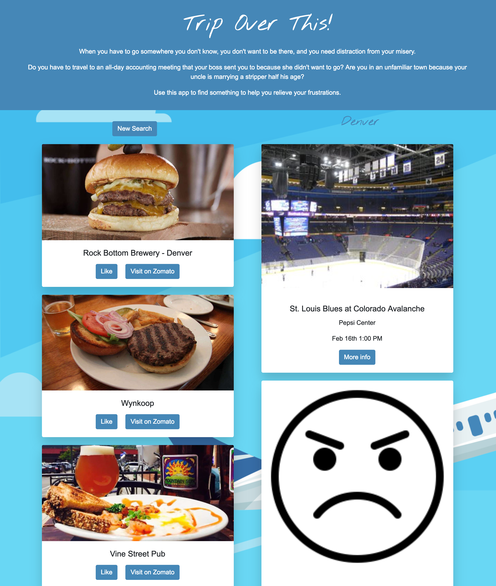

# Trip Over This

### Trip Over This provides travel inspiration for the angry, reluctant traveler. The user enters their destination city and date range and the app returns local events and breweries. Our intention in building this app was to combine humor with practicality to alleviate the problem of traveling to an unknown, and maybe unexciting, city.

## Sample User Story:
### As a user, I want to find inspiration to comfort me after a grueling 8 hour coding meeting in an unfamiliar town.

## Features:
* Data Persistence using Firebase (saves and displays the most recently searched city).
* User Input Validation. City, start date, and end date must be entered to return results. The same date can be entered for start and end dates to return same day events.

## Team members:
- Mike Hume
- Zoë Gonzales
- Lynn Amsbury
- Sara Overby

## Getting Started:
### Enter the city and dates of your choice into the form and click button

### Get results

## Built With:
- HTML5
- CSS3
    - Bootstrap 4
    - Font Awesome
    - Google Fonts
    - Animate.css
- JavaScript
    - jQuery
    - Moment.js
- Database
    - Firebase
- AJAX
    - SeatGeek API
    - Zomato API

## Deployment:
### App deployed at https://mahume.github.io/Trip-Over-This/

## Future updates:
### In future updates to the app, we plan to 
* Add additional APIs such as displaying walking trails, local Twitter feeds, and Groupon for deals.
* Add new fields to search for specific Zomato restaurant categories.
* Update input type of "date" to ensure cross-browser compatibility.
